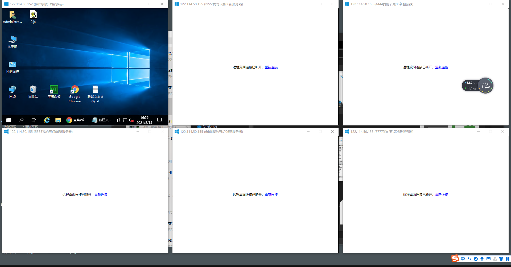

##远程桌面批量管理器（Remote Desktop Manager）
* 是基于C# 开发的一款工具 （免费，开源 ，可以根据自己需要增加功能）
* 软件的目的：让管理服务器更加方便，解放运维
* 支持同时多个主机链接
* 支持ping
* 支持中英双语切换
* 支持分组
* 支持主机颜色标记

##有问题反馈
在使用中有任何问题，欢迎反馈给我，可以用以下联系方式跟我交流
* 官网：[http://shell-x.com/](http://shell-x.com/)
* QQ：[879301117](http://wpa.qq.com/msgrd?v=3&uin=879301117&site=qq&menu=yes)
* 微信：Internetquant
* Telegram：[@xixilong](http://twitter.com/xixilong)
* QQ交流群：[660480885](https://qm.qq.com/cgi-bin/qm/qr?k=zI7Up93uxrbtzDRqwIIERFtWdOTpoZHw&amp;jump_from=webapi)
* Telegram频道: t.me/shellx9
* 微信群：请加微信邀请
* 

##软件运行效果截图
* 
* 
* 
* 
* 
* 
